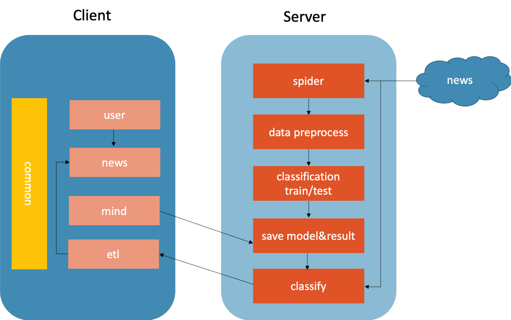

## Picasso

基于深度学习的新闻分类推荐系统

### Picasso (基于Spring Boot的新闻推荐系统)

- common模块：包含异常定义、API返回值错误码、日期计算等公共模块
- etl模块：负责服务器与客户端之间新闻数据的传输和存储 （Kafka消息中间件）
- mind模块：深度学习模块，负责深度学习模型训练结果的存储，深度学习算法代码的上传
- news模块：新闻信息查询、插入、推荐（Redis缓存+Dubbo消息通信）
- user模块：用户信息的查询、更新（Guava缓存）
- 其他：DB存放SQL DOC存放开发文档和配置使用说明 （MySQL+CentOS）

### News_Classification (基于Python的深度学习分类系统)

- classification模块：基于深度学习的文本分类器（基于Keras框架，包含模型训练、测试、评估、结果存储、数据分析）
- spider模块：新闻爬虫模块（基于PyQuery，符合robots协议）

### 系统结构图

